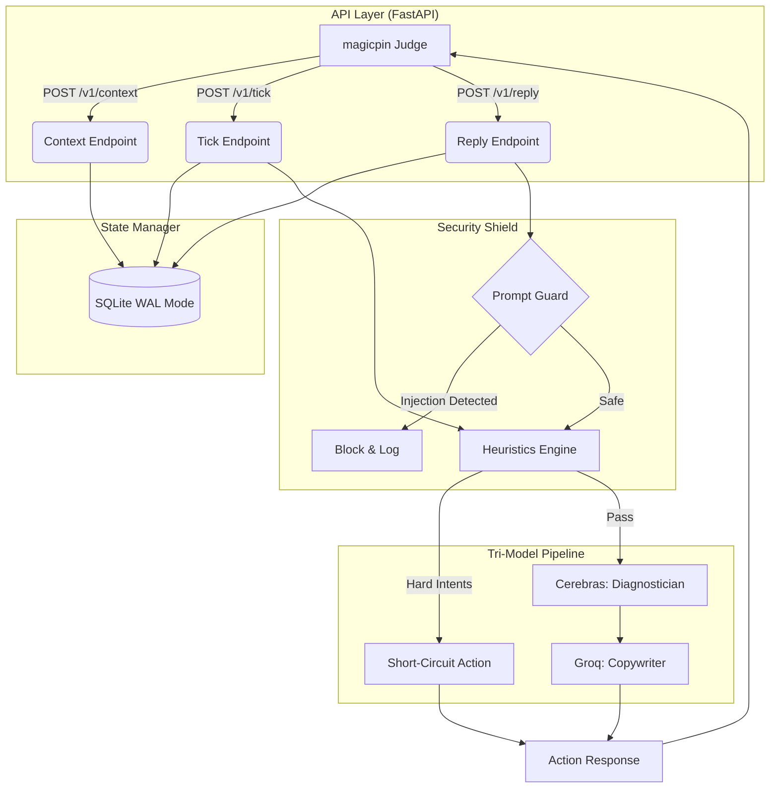

# Vera Message Engine

**Stateful, deterministic message engine for merchant engagement — magicpin AI Challenge 2026**

## 🏗 Architecture Overview

The Vera Message Engine is designed for high-throughput, idempotent execution, serving as the connective tissue between the magicpin backend and the LLM pipeline. It ensures absolute data determinism while offloading cognitive processing to a specialized multi-model stack.



### 🧠 The Tri-Model Pipeline
To balance reasoning capability with strict latency constraints, cognitive load is explicitly split across three layers:

1. **The Heuristic Engine (Deterministic First Layer):** Before any LLM is queried, the engine checks for hard rules (e.g., auto-replies, hostile intents, explicit commitments). This prevents hallucinated reasoning on structural workflow states and saves tokens.
2. **The Diagnostician (Cerebras Llama-3.1-8b):** Fast, low-latency extraction. Given the massive 4-context bundle (Category, Merchant, Trigger, Customer), Cerebras rapidly diagnoses the *single* highest-leverage signal.
3. **The Copywriter (Groq Llama-3.3-70b-versatile):** The heavy-lifter. Armed with the targeted signal from Cerebras and strict voice constraints based on Category, Groq drafts highly compelling, grounded copy with zero hallucination.

### 💾 The State Manager: Embedded SQLite
To achieve zero-latency context resolution while strictly adhering to the judge harness contract, the engine uses **SQLite3 in WAL (Write-Ahead Logging) mode**. 

* **Version-Gated Idempotency:** The `contexts` table uses a composite Primary Key of `(scope, context_id)`. During a `/v1/context` push, the engine validates the incoming `version` and gracefully rejects stale data with a `409 Conflict`, safely swallowing duplicate webhooks.
* **Synchronous Concurrency:** By using single-worker synchronous SQLite, we eliminate race conditions in state updates without needing heavy external dependencies.

### 🛡️ The Security Shield
Merchant inputs via `/v1/reply` are fundamentally untrusted. Before the LLM pipeline sees the input, it passes through the **Prompt Guard Middleware**.

* If an injection attempt is detected, the request is immediately short-circuited.
* The system logs the attempt with a `[BLOCKED]` flag in the conversation history and returns a graceful fallback response, ensuring the bot's internal persona and data exposure limits remain uncompromised.

## Setup

```bash
# 1. Clone and enter the project
cd VeraAgent

# 2. Copy and fill environment variables
cp .env.sample .env
# Edit .env with your Cerebras and Groq API keys

# 3. Install dependencies
pip install -r requirements.txt

# 4. Run the server
python main.py
```

## Docker

```bash
docker build -t vera-engine .
docker run -p 8000:8000 --env-file .env vera-engine
```

## Endpoints

| Method | Path | Description |
|--------|------|-------------|
| GET | `/v1/healthz` | Health check (200 OK) |
| GET | `/v1/metadata` | Bot identity and capabilities |
| POST | `/v1/context` | Idempotent merchant context ingestion |
| POST | `/v1/tick` | Time simulation + proactive message generation |
| POST | `/v1/reply` | Reply handling + contextual response generation |

## Design Decisions

- **SQLite with WAL mode**: Zero-latency embedded state that survives container restarts
- **Temperature = 0.0**: All LLM calls are fully deterministic
- **Fail-open security**: If Prompt Guard is unreachable, requests are allowed through (logged)
- **Version-gated upserts**: Context updates are idempotent — same or lower version is a no-op
- **Fallback pipeline**: If any LLM is unavailable, the system uses heuristic signal extraction and template-based messages grounded in real merchant data

## Tradeoffs

1. **Single worker**: SQLite requires single-writer access. Traded concurrency for data integrity.
2. **Synchronous LLM calls in executor**: Cerebras/Groq SDKs are synchronous; wrapped in `run_in_executor` to avoid blocking the event loop.
3. **Prompt Guard fail-open**: Chose availability over strict security — a blocked legitimate request costs more than a logged suspicious one.